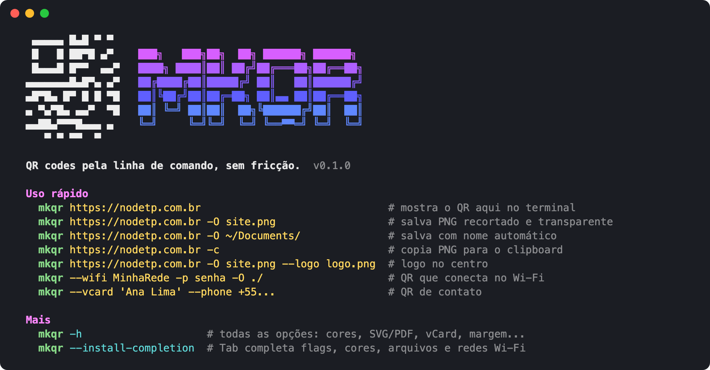

# mkqr

**QR codes pela linha de comando, sem fricção.** PNG, SVG, PDF, Wi-Fi, vCard, logo, clipboard.

[](https://github.com/berodcdev/mkqr/actions/workflows/ci.yml)
[](https://github.com/berodcdev/mkqr/releases/latest)
[](https://www.python.org/downloads/)
[](LICENSE)

🇺🇸 [Read in English](README.md)



Digite `mkqr` sem argumentos para ver o guia rápido, ou `mkqr -h` para tudo.

## Instalação

```sh
pipx install git+https://github.com/berodcdev/mkqr.git          # sempre a versão mais recente
pipx install https://github.com/berodcdev/mkqr/releases/download/v0.1.0/mkqr-0.1.0-py3-none-any.whl   # versão fixa
```

Troque `pipx` por `pip` para instalar no ambiente atual.
Depois, se quiser o Tab completando flags, cores, arquivos e redes Wi-Fi:

```sh
mkqr --install-completion
```

<details>
<summary>Instalar a partir de um clone</summary>

```sh
git clone https://github.com/berodcdev/mkqr.git && cd mkqr
./install.sh              # pipx + autocomplete do seu shell; use -e para modo editável
./uninstall.sh            # remove tudo
```

No Windows (sem bash): `pipx install .` e pronto.
</details>

> O mkqr ainda não está no PyPI.

## Uso

```sh
mkqr https://nodetp.com.br                          # mostra no terminal
mkqr https://nodetp.com.br -O ~/Documents/nodetp-qrcode.png
mkqr https://nodetp.com.br -O ~/Documents/          # nome automático: nodetp.com.br-qrcode.png
mkqr https://nodetp.com.br -c                       # copia o PNG para o clipboard
mkqr https://nodetp.com.br -O site.png --open       # salva e abre no visualizador
mkqr https://nodetp.com.br -O site.png --logo logo.png   # logo no centro
mkqr 'texto' -O card.svg --dark '#0a2540'
mkqr --wifi MinhaRede -p senha123 -O ./             # QR que conecta na rede
mkqr --vcard 'Ana Lima' --phone +5511999999999 --email ana@x.com --org Acme -O ./
echo -n 'lido do stdin' | mkqr - -O out.pdf
```

Formato de saída pelo sufixo: `.png .jpg .webp .svg .pdf .eps .txt`. Sem `-O`, imprime no terminal.

**PNG, WebP e SVG saem recortados e com fundo transparente** (sem margem), prontos para colocar em
qualquer layout. Para a versão clássica com margem branca: `-b 4 --light white`.
JPG, PDF e EPS não têm transparência e saem com fundo branco e margem 4.

## Plataformas

| | Linux | macOS | Windows |
|---|---|---|---|
| gerar QR (png, svg, pdf, terminal, Wi-Fi, vCard, logo) | ✓ | ✓ | ✓ |
| `-c` clipboard | `wl-copy` (Wayland) ou `xclip` (X11) | nativo (`osascript`) | nativo (PowerShell) |
| `--open` | `xdg-open` | nativo (`open`) | nativo |
| autocomplete | bash, zsh, fish | bash, zsh, fish | — |
| Tab lista redes Wi-Fi | `nmcli` | — | — |
| `install.sh` / `uninstall.sh` | ✓ | ✓ (bash 3.2 ok) | via `pipx install .` |

`mkqr --install-completion` detecta o seu `$SHELL`; force com `--shell zsh` (ou `bash`, `fish`, `all`).
`mkqr --uninstall-completion` desfaz tudo. O CI roda em Ubuntu, macOS e Windows, do Python 3.10 ao 3.14.

## Opções

| flag | descrição | padrão |
|---|---|---|
| `-O, --output` | arquivo ou diretório de saída | terminal |
| `-s, --scale` | px por módulo | 10 |
| `-b, --border` | margem em módulos | 0 (png/svg/webp), 4 (demais) |
| `-e, --error` | correção de erro L/M/Q/H | M (H com `--logo`) |
| `--dark`, `--light` | cores; `--light white` para fundo branco | #000 / transparente |
| `--logo IMAGEM` | imagem no centro (png/jpg/webp); `--logo-size` 0.1 a 0.3 | 0.22 |
| `-c, --copy` | copia o QR (PNG) para o clipboard | |
| `--open` | abre o arquivo gerado no visualizador padrão | |
| `--wifi SSID` | QR de rede Wi-Fi; com `-p SENHA`, `--security WPA/WEP/nopass`, `--hidden` | |
| `--vcard NOME` | QR de contato; com `--phone`, `--email`, `--url`, `--org`, `--title` | |
| `--micro` | permite Micro QR quando o conteúdo couber | |
| `-f, --force` | sobrescreve arquivo existente | |
| `-q, --quiet` | não imprime o caminho | |
| `--install-completion` | instala o autocomplete do seu shell; `--shell bash/zsh/fish/all` | |
| `--uninstall-completion` | remove o autocomplete de todos os shells | |
| `--no-color` | desliga as cores (ou defina `NO_COLOR`) | |

A ajuda completa (`mkqr -h`) também está em imagem: [docs/img/mkqr-help.svg](docs/img/mkqr-help.svg).

## Construído sobre

[segno](https://github.com/heuer/segno) (geração do QR),
[qrcode-artistic](https://github.com/heuer/qrcode-artistic)/Pillow (logo, jpg/webp),
[argcomplete](https://github.com/kislyuk/argcomplete) (autocomplete).

## Desenvolvimento

```sh
git clone https://github.com/berodcdev/mkqr.git && cd mkqr
python -m venv .venv && . .venv/bin/activate
pip install -e ".[dev]"
pytest
```

Veja [CONTRIBUTING.md](CONTRIBUTING.md) para o fluxo completo e
[CHANGELOG.md](CHANGELOG.md) para o que mudou entre as versões.

## Licença

MIT — veja [LICENSE](LICENSE).
